<div align="center">

# 道

### michi

*A local-first ML workbench —*
*automate the implementation, never the judgement.*

<br>

[](https://github.com/cattolatte/michi/actions/workflows/ci.yml)
[](https://github.com/cattolatte/michi/releases)
[](https://pypi.org/project/komichi/)
[](https://www.python.org/)
[](LICENSE)
[](https://mypy-lang.org/)
[](https://github.com/astral-sh/ruff)

<br>



<sub>Recorded, not mocked up — every line above came from an actual run.</sub>

</div>

<br>

Michi is a toolbox of independent command-line tools that automate the
repetitive implementation work of machine learning — profiling datasets,
cleaning them, evaluating models, benchmarking, running experiment grids, and
reporting — while leaving every judgement call to you.

It works on the projects you already have: your CSV, your `model.pkl`, your
repo. There is no project template to adopt, no framework to import, no
account to create, and nothing ever leaves your machine.

<br>

> ## 名前 — on the name
>
> **道** (*michi*) means "path" or "road". Read as **-dō**, the same character
> closes the names of Japanese disciplines — 柔道 (*jūdō*, the yielding way),
> 書道 (*shodō*, the way of writing), 茶道 (*chadō*, the way of tea) — where it
> means not merely a road, but *a practice one walks for oneself*.
>
> That is the entire design brief. Michi clears the path. You walk it.
>
> On PyPI the name was taken, so michi is distributed as **小道** (*komichi*) —
> a small path, a lane. The command you type is still `michi`.

<br>

## 使い方 — getting started

```bash
pip install komichi
michi inspect data.csv --target label --explain
```

The package is `komichi` (小道, *a small path*) because `michi` was already
taken on PyPI. The command and the import are both `michi`.

New here? The [quickstart](docs/quickstart.md) takes one messy CSV to a
compared, reported model in fifteen minutes, and asks for no commitment along
the way.

Optional extras: `komichi[bench]` (XGBoost, LightGBM, CatBoost), `komichi[excel]`,
`komichi[shap]`, `komichi[ui]`.

<br>

## 道具 — the toolbox

Every verb stands alone. Use one, ignore the rest.

| Verb | What it does | Status |
|---|---|:---:|
| `michi inspect data.csv` | Profile a dataset: types, missing values, duplicates, skew, imbalance, correlations, outliers, leakage suspects — every finding explained | **v0.1** |
| `michi eval model.pkl data.csv --target y` | Rigorously evaluate an existing model: metrics with intervals, calibration, baselines, subgroup gaps | **v0.2** |
| `michi bench … --models rf,linear,xgb` | Train and compare models with honest CV, confidence intervals, significance tests | **v0.3** |
| `michi split data.csv --group customer` | Train/test splits that respect entities and time — where leakage actually hides | **v1.9** |
| `michi tune … --model hist-gbm` | Hyperparameter search, scored on folds the search never saw | **v1.4** |
| `michi ensemble … --models linear,rf,xgb` | Stack or vote several models — and see whether it actually beat the best one | **v1.6** |
| `michi bench … --models mlp,torch-mlp` | Neural networks with the training loop written for you — same CV, same baseline, same honesty | **v1.5** |
| `michi fit` · `predict` | Train the model you chose, then predict on data with no labels — the submission file | **v1.4** |
| `michi clean` · `apply` · `export` | Interactive cleaning **and feature engineering** that authors a reproducible recipe and exports readable pipeline code | **v0.4** · **v1.1** |
| `michi` | Interactive console with context-aware completion; `path` maps the stages, `walk` asks its way through them | **v0.5** · **v1.1** |
| `michi sweep sweep.yaml` | Reproducible experiment grids: models × recipes × seeds, with resume | **v0.6** |
| `michi report runs/` | HTML · Markdown · LaTeX reports over recorded runs | **v0.3** |
| `michi ui` | Local, read-only viewer: confusion matrix, calibration curve, intervals, subgroup gaps | **v0.7** · **v1.7** |
| `michi plugins` | Add your own models and model loaders | **v0.8** |

<br>

## 見本 — a look

```bash
michi inspect data/customers.csv --target purchased
```

```
 道  michi inspect  ·  customers.csv

  600 rows × 14 columns  ·  14.5% of cells missing  ·  0 duplicate rows  ·
  target purchased
  sha256 0dbfe06c8719  ·  42.0 KB

  column         kind          missing   unique   summary
  ──────────────────────────────────────────────────────────────────────────
  age            numeric             —       45   mean 42.702 · range 20–64
  salary         numeric         13.5%      511   mean 39,358 · 1 outliers
  region         categorical         —        4   top: north (239), south (188)
  cabin          categorical     89.0%       66   top: C13 (1), C37 (1)
  notes          empty          100.0%        0
  fare           numeric             —      467   skew +6.87 · 37 outliers
  amount_text    text                —      598   length 5–6
  …

  Findings (14)

  high    country                only one distinct value (JP)
  high    notes                  every value is missing
  high    cabin                  89.0% missing (534 of 600)
  high    outcome_code           each of its 2 values maps to exactly one
                                 'purchased' class
  warn    country, country_copy  identical values in country, country_copy
  warn    age, age_months        correlation +1.000
  warn    signup_date            values parse as dates but are stored as text
  warn    amount_text            100% of values parse as numbers
  …

  Run again with --explain for what each finding means and your options.
```

That fourth finding is the one to stop on: `outcome_code` predicts the label
perfectly, which almost always means it was recorded *after* the outcome and
will not exist when the model runs. Catching it here saves a week later.

`--html` writes a [self-contained offline report](examples/profile.html)
(no CDN, no JavaScript). `--json` writes a
[machine-readable profile](examples/profile.json) you can diff in CI, and
`--fail-on high` turns michi into a data-quality gate.

Record what you decided, then compare some models on the cleaned data:

```bash
michi clean data/customers.csv --target purchased   # writes a recipe you own
michi bench data/customers.csv --target purchased \
  --recipe michi.recipe.yaml --models linear,rf,hist-gbm
```

```
 道  michi bench  ·  4 models

  classification  ·  600 rows  ·  5-fold cross-validation  ·  target purchased
  preparation: numeric: impute median · categorical: impute most_frequent +
  onehot · standardise (scale-sensitive models only) — fitted inside each fold

  Results  (ranked by balanced_accuracy)

  model      balanced_accuracy      95% interval   vs leader               fit
  ────────────────────────────────────────────────────────────────────────────
  linear                 0.892   0.8599 – 0.9241   leader                 0.3s
  rf                     0.878   0.8323 – 0.9235   tied with leader       0.9s
                                                   (p=0.589)
  hist-gbm               0.875     0.83 – 0.9192   tied with leader       2.0s
                                                   (p=0.589)
  dummy                    0.5         0.5 – 0.5   worse (p<0.0001)       0.0s

  Verdict  linear scores highest, but rf, hist-gbm are statistically
  indistinguishable from it at this sample size. Choosing between them on
  these numbers alone is not supported.
```

Most tools would have declared `linear` the winner. Differences are tested
with the corrected resampled *t*-test (Nadeau & Bengio, 2003), because
cross-validation folds share training data and a naive test calls noise
significant. A dummy baseline is always included, so "is this any good?" has
an answer — here, clearly yes.

Or run `michi` with no arguments for the console, where tab completion knows
*your* column names:

```
michi › use data/customers.csv
loaded customers.csv — 14 columns
michi (customers.csv) › set target purchased
michi (customers.csv → purchased) › bench --models linear,rf
…
michi (customers.csv → purchased) › history --export session.sh
  wrote session.sh — a replayable script of one-shot michi commands
```

The console is a skin over the same commands — it adds no capability, and
every session exports back to plain one-shot invocations.

Full options: [`michi inspect`](docs/inspect.md) · [`michi eval`](docs/eval.md) ·
[`michi bench`](docs/bench.md) · [`michi tune` · `fit` · `predict`](docs/tune.md) ·
[`michi report`](docs/report.md) ·
[`michi clean`](docs/clean.md) · [`michi sweep`](docs/sweep.md) ·
[`michi ui`](docs/ui.md) · [the console](docs/console.md).

<br>

## 心得 — principles

**道具、流れにあらず** · *A toolbox, not a workflow.*
Use one verb, ignore the rest, keep your own project structure.

**献立、勧めにあらず** · *Menus, not recommendations.*
Michi lists the options; you choose. Defaults exist for mechanics — folds,
seeds — never for judgement.

**作品、記憶にあらず** · *Artifacts, not sessions.*
Every decision becomes a durable, versionable file you own.

**厳密さは既定** · *Rigor by default.*
Baselines, confidence intervals, significance tests, leakage checks — opt-out,
not opt-in.

**手元にて完結** · *Entirely local.*
No server, no account, no telemetry, no network call. Ever.

The full reasoning, and the list of things michi will deliberately never do,
lives in [the philosophy](docs/philosophy.md); what ships when is in
[the roadmap](docs/roadmap.md). Extending michi with your own models or model
loaders is covered in [the plugin guide](docs/plugins.md).

<br>

## 開発 — development

```bash
uv sync --extra dev --extra ui
uv run ruff check . && uv run ruff format --check .
uv run mypy src/michi
uv run pytest
```

All four gates run in CI on Linux, macOS, and Windows, against Python 3.11
and 3.13. [CONTRIBUTING.md](CONTRIBUTING.md) covers what is most welcome, and
what michi says no to.

## 約束 — the promise

From 1.0, the artifact schemas, the CLI surface, and the plugin contract are
frozen under semantic versioning
([ADR-0002](docs/adr/0002-freeze-the-public-surface.md)). A regression test
reads committed 1.0 artifacts on every CI run, so an artifact michi writes
today stays readable — that is enforced, not promised.

Growth from here happens at the edges, in plugins, rather than in the core.

<br>

## ライセンス — license

[MIT](LICENSE)

<br>

<div align="center">

*用の美* — beauty through use.

</div>
